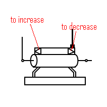
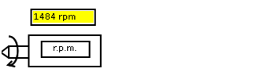
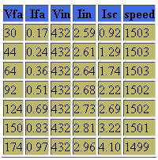
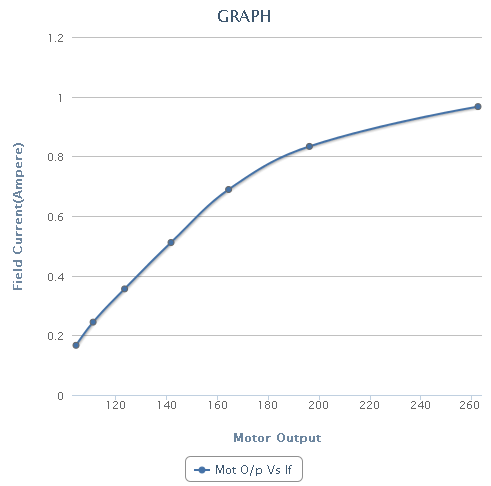

### Short Circuit Test on Three Phase Alternator
1. Stator terminals are Short Circuited in order to perform SC test on alternator.
2. Close the DPST (Double Pole Single Throw) switch connecting the armature winding of DC shunt motor to supply.
3. Rheostat is used as a potential divider. It is used to increase or decrease the stator voltage of DC shunt motor.

4. Bring DC shunt motor to its rated speed (1500rpm) and Alternator is made to run at its synchronous speed (1500rpm) using DC shunt motor.
5. As DC shunt motor is connected mechanically to alternator, So both machines rotate with same speed. Therefore we can observe speed of alternator in digital tachometer.

6. Close the DPST switch connecting the alternator to supply.
7. Vary DC excitation of alternator in steps to increase field voltage to its rated value.
8. Observe the readings of voltmeter and ammeter.
9 Store this data by clicking “Start Storing Data”
10. Go on repeating this procedure till sufficient readings are stored.
11. Now display the data by clicking “Show data”. For Ex it will display data as shown.

* Vfa=field voltage of alternator
* Ifa=field current of alternator
* Vin=input voltage DC motor
* Iin=input current of DC motor
* Isc=short circuit current

12. Now select one of the graph from available graphs and use “Generate graph” to plot the graph. For Ex.

13. Slowly reduce the excitation and field rheostat of shunt motor to zero.
14. Switch off supply.